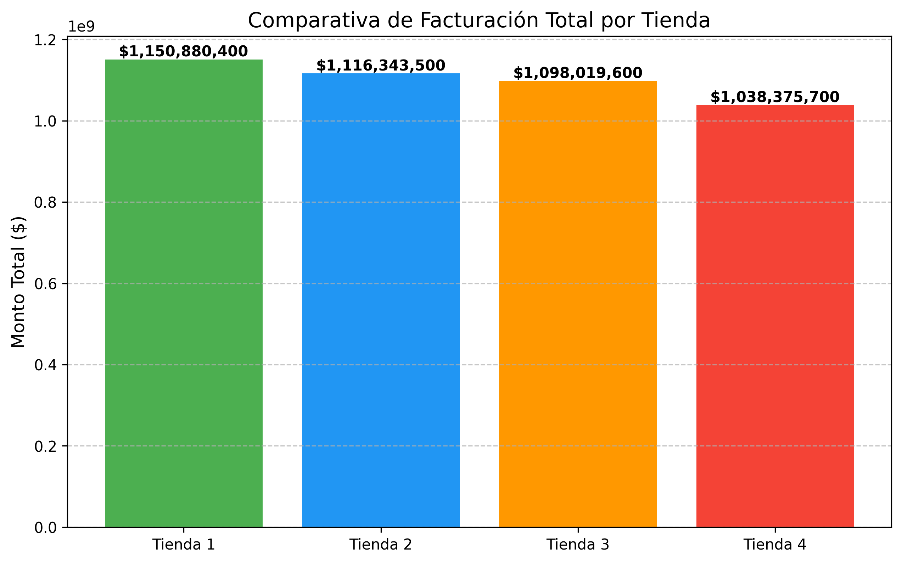
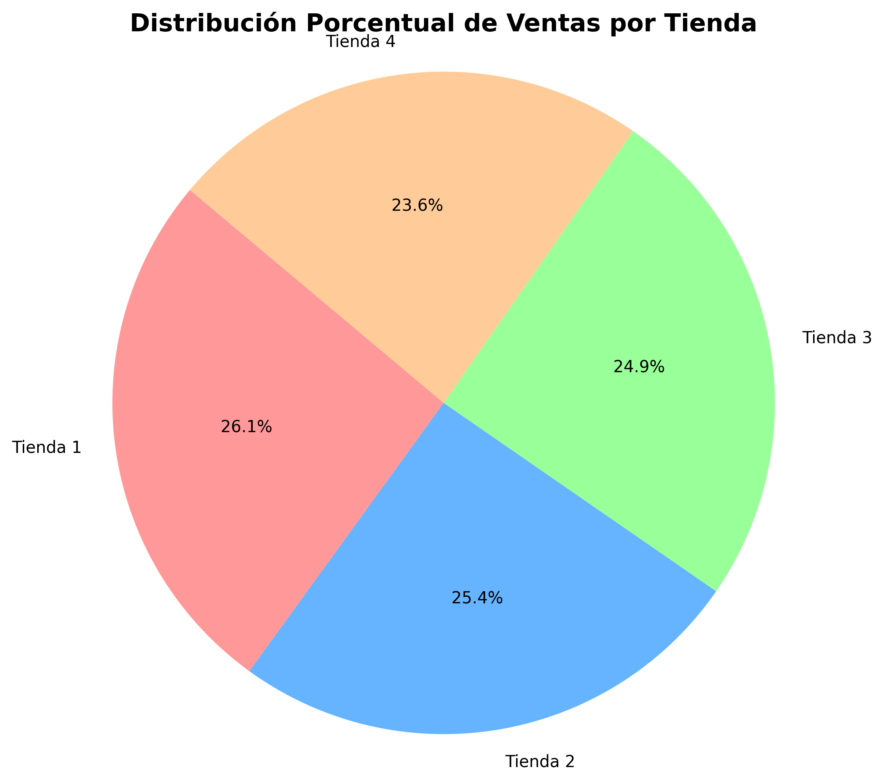
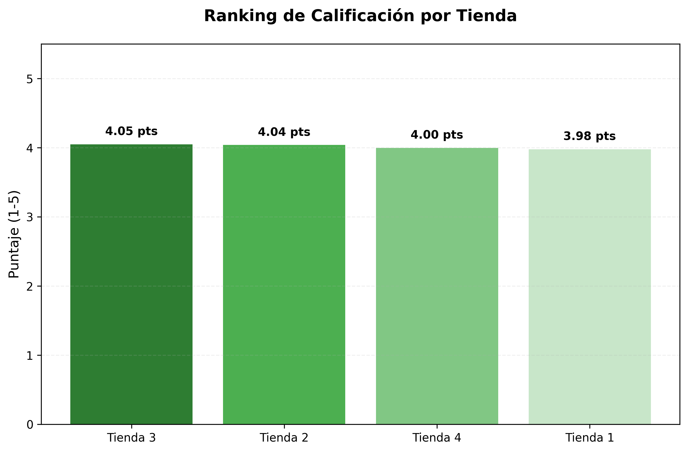
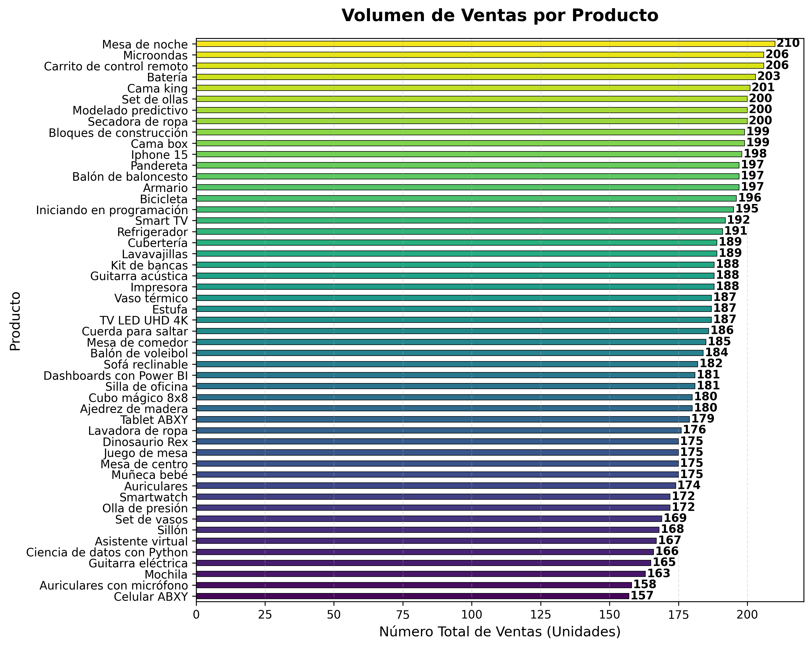
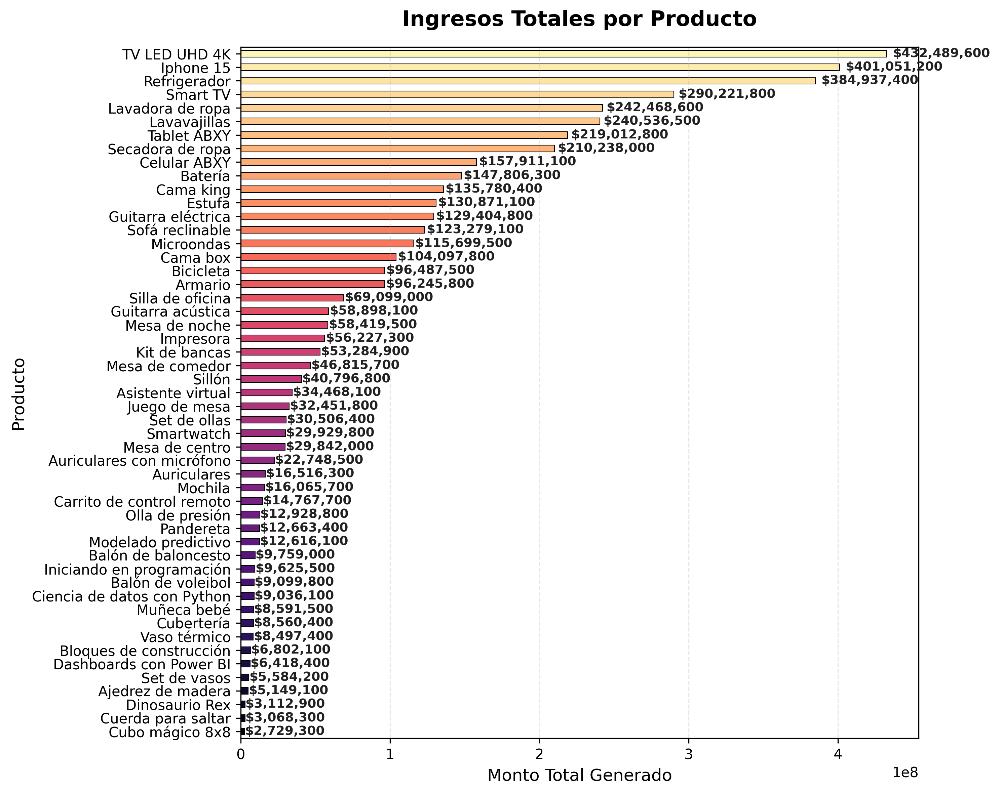
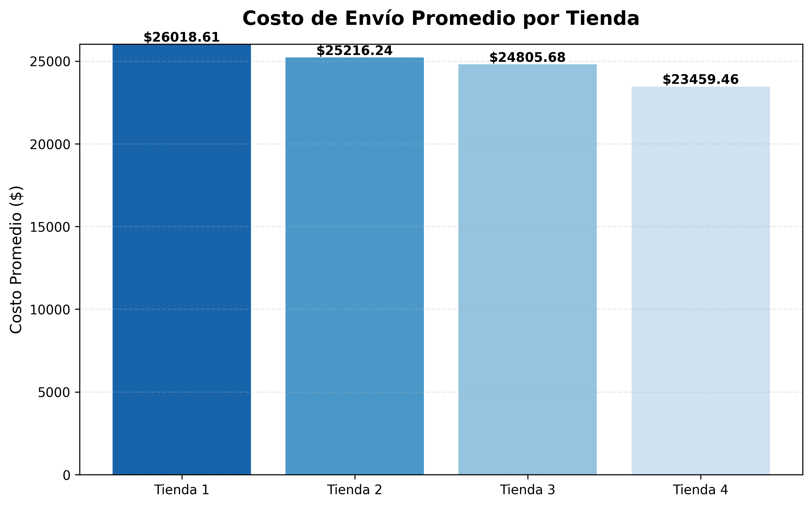
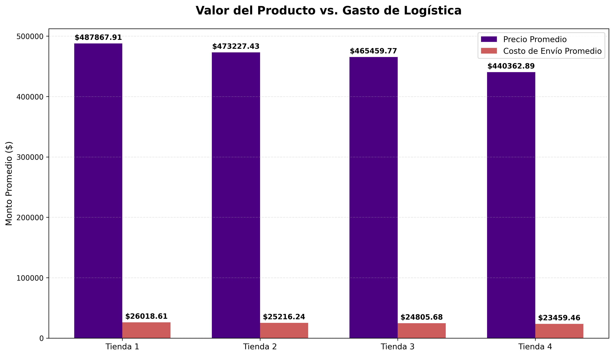

# Challenge_AluraStore

# 📈 Tiendas del Sr. Juan

Este proyecto presenta un análisis integral de datos para una cadena de cuatro tiendas. El objetivo principal es identificar la sucursal con menor desempeño operativo y financiero para fundamentar una decisión estratégica de venta.

## 🎯 Propósito del Análisis
El Sr. Juan requiere optimizar su portafolio de negocios. Este análisis evalúa cada tienda bajo una perspectiva de 360°, analizando:
* **Rentabilidad:** Facturación total.
* **Ventas por Categoria:** Segun cada tienda
* **Satisfacción del Cliente:** Rankings de calificación.
* **Inventario:** Volumen de ventas y categorías más rentables.
* **Logística:** Eficiencia en costos de envío por sucursal.

---

## 📈 Hallazgos Visuales

### **Facturacion total por cada tienda**
La comparativa de facturación muestra la disparidad de ingresos entre las tiendas, mientras que el gráfico de pastel detalla la cuota de mercado de cada una.

### **Ventas por categoría**
En esta sección se analiza cómo se distribuye el éxito comercial entre los diferentes departamentos de las tiendas, comparando la cantidad de unidades vendidas frente a los ingresos reales generados.
[Volumen por Tienda](volumen_ventas_tiendas.png)
[Ingresos por Tienda](ingresos_categoria_tiendas.png)
[Porcentaje Total](porcentaje_categoria.png)

### **Promedio de Calificación de los clientes**
La satisfacción del cliente es un indicador crítico de la salud a largo plazo de cada sucursal. En esta sección, comparamos cómo los consumidores perciben la calidad del servicio y los productos en cada tienda.

### **Productos más y menos vendidos**
Este apartado profundiza en el catálogo de productos para identificar cuáles son los motores de venta y cuáles tienen un rendimiento inferior. Analizamos esta métrica desde dos perspectivas: el volumen físico de unidades y el impacto financiero total.

### **Costo promedio del envío**
En esta sección analizamos el impacto de los costos de envío en la operación. Un costo logístico elevado puede neutralizar las ganancias de una venta, por lo que medir la eficiencia de cada sucursal es vital para la rentabilidad neta.

### **Rendimiento por tienda**
El gráfico de radar es la herramienta final de diagnóstico. En lugar de mirar tablas aisladas, esta visualización normaliza todas las variables (Facturación, Satisfacción, Eficiencia Logística, Ticket Promedio y Volumen) para mostrar el equilibrio operativo de cada sucursal.
.png)

#### Análisis de la Geometría de Rendimiento:

Al observar la superposición de las áreas, podemos extraer conclusiones críticas sobre la salud de cada activo:

* **Tienda 1 (Línea Azul - El Gigante Ineficiente):** * Domina los ejes de **Facturación** y **Ticket Promedio** (alcanzando el nivel 1.0).
    * Sin embargo, colapsa en **Eficiencia Logística** y **Satisfacción**, lo que indica una operación que genera mucho dinero pero a un costo operativo y reputacional muy alto.
* **Tienda 3 (Línea Verde - La Operación Saludable):** * Es la tienda más equilibrada. Lidera el eje de **Satisfacción** y mantiene un área expandida y constante en casi todos los puntos.
* **Tienda 4 (Línea Roja - El Diagnóstico de Venta):** * Su geometría es la más reducida del grupo, formando un **triángulo isósceles contraído**.
    * Aunque muestra un pico máximo en **Eficiencia Logística** (envíos baratos), está en los niveles más bajos de **Facturación**, **Volumen de Ventas** y **Variedad de Catálogo**.
    * Su punto más alarmante es la **Satisfacción (cerca del 0.2)**, lo que confirma que no tiene una base de clientes sólida para crecer.
